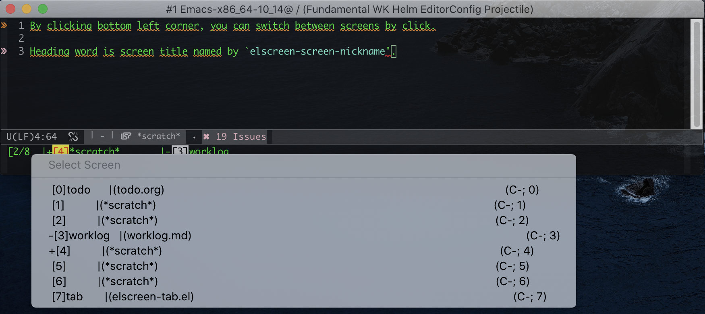
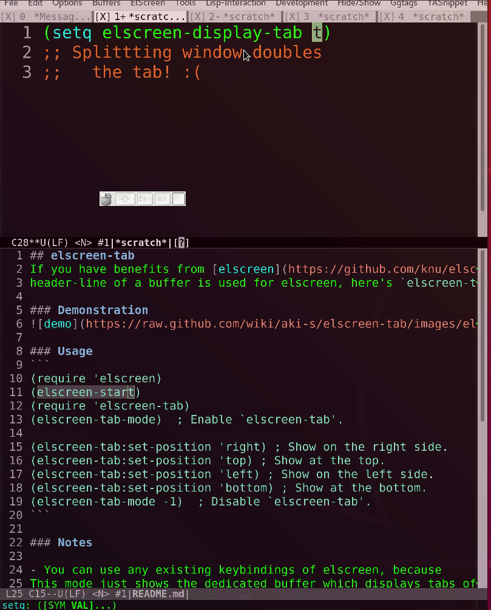

[](https://melpa.org/#/elscreen-tab)

## elscreen-tab
Keep tabs of `elscreen` displayed on a dedicated window.

- If [elscreen](https://github.com/knu/elscreen) benefits you, but you have been annoyed by
header-line being used for elscreen, here's `elscreen-tab` for you.

### Prerequisite

kind  | target
---|---
OS    | MacOS, Ubuntu
Emacs |26.3 and higher.

### Usage
```
(require 'elscreen)
(elscreen-start) ; Need to enable elscreen as a prerequisite of `elscreen-tab'.
(require 'elscreen-tab)
(elscreen-tab-mode)  ; Enable `elscreen-tab'.

(elscreen-tab-set-position 'right) ; Keep displaying on the right side.
(elscreen-tab-set-position 'top) ; Keep displaying on the top.
(elscreen-tab-set-position 'left) ; Keep displaying on the left side.
(elscreen-tab-set-position 'bottom) ; Keep displaying on the bottom.
(elscreen-tab-mode -1)  ; Disable `elscreen-tab'.
```

### Images


### Demonstration


### Notes

- Switching screens with both enter key and click with mouse are supported since 1.1.0.
- You can use any existing keybindings of elscreen, because
`elscreen-tab-mode` just keep displaying tabs of elscreen at the specified side.
- You may try `tab-bar-mode` as an alternative if you are using Emacs version 27.
